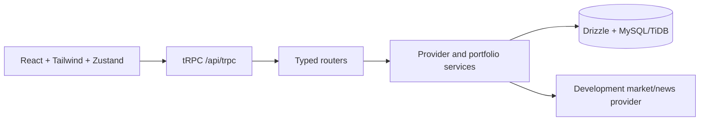

# vestor — Paper Trading & Portfolio Intelligence Foundation

vestor is a production-minded V1 foundation for an educational paper-trading platform. It gives a user a protected workspace, ₹10,00,000 in configurable virtual starting capital, simulated market data, stock research, market orders, holdings, P&L, watchlists, development news, and price alerts.

**This is not a real-money trading application.** No broker, payment gateway, exchange, or live order book is connected. Market data in the V1 interface is clearly labeled as simulated development data.

## V1 features

- Local demo registration, login, persistent session, and logout flow; Manus OAuth remains available through the scaffold.
- Dashboard with cash, invested value, portfolio value, P&L, top holdings, allocation, watchlist, and market brief.
- Searchable markets page with symbol/company search, sector filters, stock detail pages, chart ranges, quote metadata, and watchlists.
- Paper BUY/SELL market orders with insufficient-cash and insufficient-holdings validation.
- Orders, transactions, holdings, average buy price, derived current value, unrealized P&L, and return percentages.
- Basic price alerts, development news, and explicit next-version placeholders for analytics and account settings.
- Normalized Drizzle schema for users, stocks, market data, portfolios, holdings, orders, transactions, watchlists, news, alerts, and portfolio snapshots.
- Provider-neutral market data service boundary and pure portfolio calculations with Vitest coverage.

## Tech stack

React 19, TypeScript, Vite, Tailwind CSS 4, wouter, Zustand, Recharts, Express, tRPC, Drizzle ORM, MySQL/TiDB, Manus OAuth scaffold, and Vitest.

## Repository structure

```text
client/src/components/        shared workspace shell and visual widgets
client/src/pages/              public auth, dashboard, market, trading, history pages
client/src/store/              Zustand demo session and paper-account stores
client/src/utils/              presentation formatters
server/services/               provider-neutral market data and portfolio rules
server/db.ts                   database query helpers
server/routers.ts              typed tRPC procedures
shared/                        market fixtures and domain calculation types
drizzle/schema.ts              normalized relational schema
drizzle/migrations/            generated migration SQL
docs/                          architecture, database, API, and acceptance docs
```

## Local setup

```bash
pnpm install
cp .env.example .env
pnpm drizzle-kit generate
pnpm check
pnpm test
pnpm build
pnpm dev
```

The WebDev scaffold provisions the database connection and OAuth environment for preview/deployment. For an independent local database, use a MySQL/TiDB-compatible `DATABASE_URL`, then run the generated migration with the project's `db:push` workflow.

The live preview in this task is available through the WebDev project tooling. Open `/` for the public landing page, `/register` for demo registration, and `/dashboard` after signing in.

## Environment variables

`DATABASE_URL`, `JWT_SECRET`, and the Manus runtime variables are provisioned by the WebDev environment. `INITIAL_VIRTUAL_CASH` controls the starting cash balance and defaults to `1000000` in the typed account bootstrap procedure. External provider keys belong only on the backend.

## Testing

```bash
pnpm check
pnpm test
pnpm build
```

The foundation test suite covers weighted average buy price, current value, P&L, return percentages, zero-value handling, trade validation, market search, and historical price ranges.

## Architecture



The V1 deliberately stops before risk scoring, correlations, stress testing, machine learning, sentiment, recommendations, and an AI copilot. Those should be added as separate services/modules after the foundation is stable.

## Paper-trading disclaimer

All balances, holdings, order executions, portfolio values, and P&L in this project are simulated. They do not represent real exchange demand, real brokerage execution, or financial advice. Replace the development market provider with a verified licensed source before any production market-data use.
