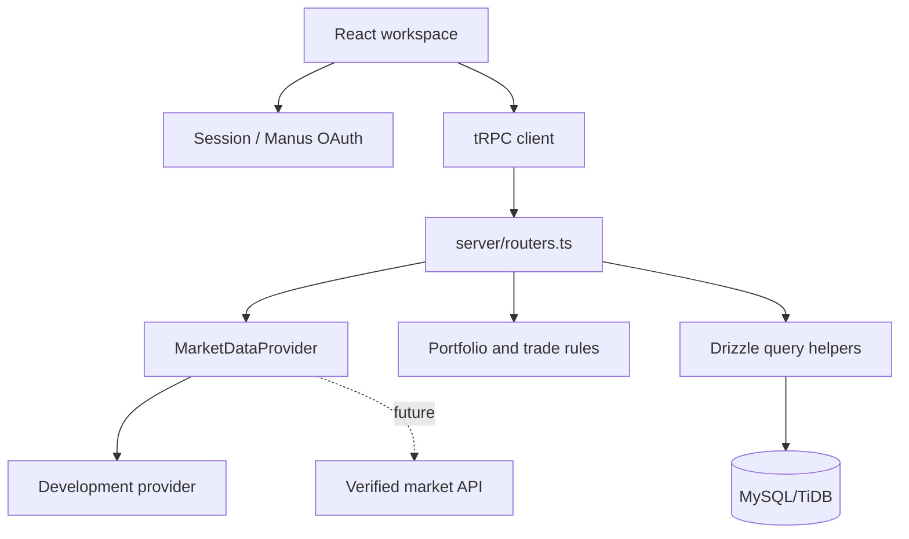
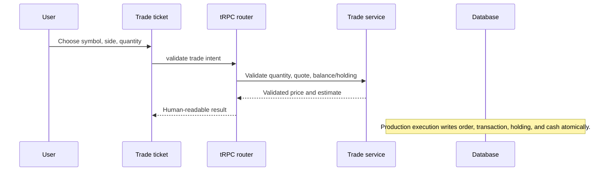

# Architecture

## Overview

The application is a modular monolith. The frontend owns interaction state and presentation, the typed server router owns contracts and authorization boundaries, the service layer owns domain rules, and Drizzle owns relational persistence. Advanced risk, ML, and AI features are deliberately not present in V1.

## Frontend

`TradingLayout` provides the responsive sidebar, persistent navigation, simulated-data banner, and account controls. Page-level modules keep the flows readable: dashboard, markets, stock details, trade, portfolio, history, watchlist, news, alerts, and explicit next-version pages. Zustand stores the local review account so the complete V1 acceptance path is usable in a preview without requiring a real-money account.

The visual language is intentionally calm: warm off-white surfaces, deep ink navigation, lavender action color, emerald positive movement, rose negative movement, and explicit data-mode labels. Recharts is isolated inside reusable trading widgets.

## Backend

The server follows a typed route → service → database shape. `server/routers.ts` contains thin tRPC procedures. `server/services/marketDataService.ts` implements the `MarketDataProvider` contract using development fixtures. `server/services/portfolioService.ts` exports pure, independently testable rules for weighted average price, P&L, return percentage, and trade validation. `server/db.ts` contains reusable query helpers and never exposes password hashes through the application procedures.

The scaffold's Manus OAuth callback and protected tRPC procedure are kept intact. `account.bootstrap` demonstrates how a protected request receives a configurable virtual starting cash amount. The review UI also provides a local demo session so the interface can be exercised without an OAuth handoff.

## Paper-trading flow

The local V1 paper account mirrors that contract in a persisted Zustand store so the acceptance journey can be reviewed in the browser immediately. The normalized database schema is ready for the full atomic transaction service as the next backend implementation milestone.

## Portfolio calculation flow

Market price is the input. Current value, invested value, unrealized P&L, return percentage, total portfolio value, and allocation are derived. Allocation is never labeled as risk contribution. Portfolio snapshots exist for future historical analytics, but V1 does not calculate volatility, beta, drawdown, Sharpe, VaR, or any risk score.

## Future extension points

The next engineering phase can add a transactional trade service, a verified market-data adapter, scheduled snapshot creation, and a separate risk-engine module without rewriting the frontend or the market provider contract. ML and AI explanation layers should consume domain outputs rather than being mixed into order execution or basic portfolio calculations.
