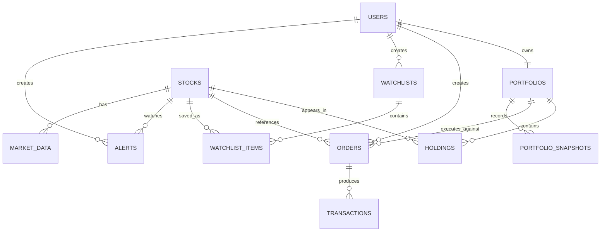

# Database

The schema is defined in `drizzle/schema.ts` and generated into `drizzle/0001_legal_iron_fist.sql`. It uses MySQL/TiDB types because the WebDev full-stack runtime provides that database surface.

## Tables

| Table | Purpose | Important fields |
|---|---|---|
| `users` | Auth identity | `openId`, name, email, role, session timestamps |
| `stocks` | Latest instrument quote | unique symbol, company metadata, quote/range fields |
| `market_data` | Historical candles | stock id, UTC timestamp, OHLC, volume |
| `portfolios` | One portfolio per user | unique `userId`, configurable cash balance |
| `holdings` | Current positions | portfolio id, stock id, quantity, average buy price |
| `orders` | Intent and execution record | side, order type, requested/executed price, status |
| `transactions` | Completed financial movement | linked order, BUY/SELL, quantity, price, total |
| `watchlists` | Named user lists | unique user/name pair |
| `watchlist_items` | Stocks in a list | unique watchlist/stock pair |
| `news` | Provider-backed market news | title, description, source, published time, sector |
| `alerts` | User price thresholds | stock, above/below type, target, active state |
| `portfolio_snapshots` | Future analytics time series | total, cash, invested, P&L, UTC timestamp |

## Relationships

## Constraints and indexes

- Stock symbols are unique.
- A portfolio is unique per user.
- Holdings are unique per portfolio/stock pair; this prevents duplicate position rows.
- Watchlist names are unique per user.
- Watchlist items are unique per watchlist/stock pair.
- Search and read paths are indexed for stock sector, market-data time series, news publication/sector, user order history, user transaction history, active alerts, and portfolio snapshots.
- All persisted business timestamps are UTC-capable database timestamps. The browser formats timestamps for the user's locale.

## Financial data boundaries

`stocks` and `market_data` are market inputs. `orders` and `transactions` are paper-trading records. `holdings` and `portfolios` are user-owned state. `portfolio_snapshots` are future analytics inputs. Derived P&L and allocation should be calculated from these values instead of redundantly stored in multiple places.

The V1 does not store or expose a risk contribution field. Allocation is a presentation calculation based on current position value divided by total portfolio value.
